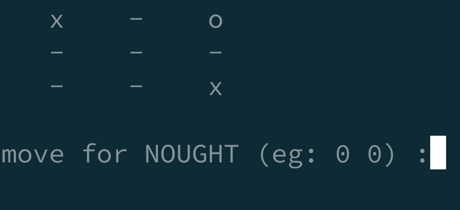

# FP Kotlin Tic-Tac-Toe



This is a functional programming implementation of the classic Tic-Tac-Toe game in Kotlin. The project aims to showcase functional programming principles and concepts using Kotlin's functional features.

## Features

- Implemented using pure functional programming principles
- Utilizes the [arrow-kt](https://arrow-kt.io/) library
- Uses immutable data structures and avoids side effects in the core using an IO monad
- Utilizes higher-order functions, lambda expressions, and function composition
- Supports human vs. human gameplay
- Provides a simple command-line interface for user interaction

## Getting Started

*Requires Java 17* to be installed, [alternatively docker can be used via batect](#getting-started-without-java)
To get started with the Tic-Tac-Toe game, follow these steps:

1. Clone the repository:

   ```shell
   git clone https://github.com/monkey-codes/fp-kotlin-tictactoe.git
   ```

2. Navigate to the project directory:

   ```shell
   cd fp-kotlin-tictactoe
   ```

3. Build the project using Gradle:

   ```shell
   ./gradlew build
   ```

4. Run the game:

   ```shell
   ./gradlew run
   ```

   This will start the game and display the game board in the command-line interface.

## Getting Started without Java

*Requires docker.* Follow the checkout steps [above](#getting-started) (step 1 & 2 ), then:


3. Build the project using Batect:

   ```shell
   ./batect build
   ```

4. Run the game:

   ```shell
   ./batect run
   ```

## How to Play

The game is played on a 3x3 grid. Each player takes turns placing their symbol (either 'X' or 'O') on an empty cell. The goal is to form a horizontal, vertical, or diagonal line of three symbols before the opponent does.

When it is your turn, you will be prompted to enter the row and column numbers of the cell where you want to place your symbol. The row and column numbers are zero-based, meaning they range from 0 to 2.

For example, to place your symbol in the top-left cell, you would enter `0` for the row and `0` for the column.

Enjoy playing Tic-Tac-Toe!

## Contributing

Contributions are welcome! If you have any ideas, suggestions, or improvements, please feel free to open an issue or submit a pull request.

Before contributing, please ensure that your code adheres to the project's coding conventions and is properly tested.

## License

This project is licensed under the [MIT License](LICENSE).

## Acknowledgments

This project was inspired by the functional programming principles and concepts in Kotlin as described in 
[Functional Programming in Kotlin by Marco Vermeulen](https://www.amazon.com/Functional-Programming-Kotlin-Marco-Vermeulen/dp/161729716X). 
The project also makes use of the [arrow-kt](https://arrow-kt.io/) library.
